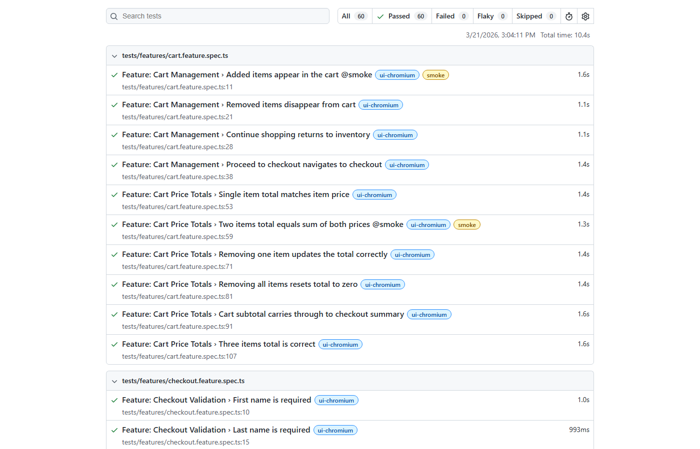

# Playwright Automation Framework

[](https://github.com/AuzzieH/playwright-framework/actions/workflows/playwright.yml)

A professional test automation framework built with **Playwright** and **TypeScript** covering both **UI** and **API** testing. Features a clean **Feature / Step / Page** layered architecture, environment-based configuration, test tagging, Allure reporting, and full CI/CD integration.

|         | Target                                                                   | Tests                      |
| ------- | ------------------------------------------------------------------------ | -------------------------- |
| **UI**  | [SauceDemo](https://www.saucedemo.com) e-commerce site                   | 45 tests across 9 features |
| **API** | [Restful-Booker](https://restful-booker.herokuapp.com) hotel booking API | 15 tests across 5 suites   |

### Playwright HTML Report

<p align="center">
  
</p>

---

## Tech Stack

| Tool                                                             | Purpose                            |
| ---------------------------------------------------------------- | ---------------------------------- |
| [Playwright](https://playwright.dev/)                            | End-to-end testing framework       |
| [TypeScript](https://www.typescriptlang.org/)                    | Type-safe JavaScript               |
| [ESLint](https://eslint.org/) + [Prettier](https://prettier.io/) | Code quality & formatting          |
| [Allure](https://allurereport.org/)                              | Test reporting with history trends |
| [GitHub Actions](https://github.com/features/actions)            | CI/CD pipeline                     |

## Quick Start

```bash
git clone https://github.com/AuzzieH/playwright-framework.git
cd playwright-framework
npm install
npx playwright install --with-deps
cp .env.example .env

npm test                  # Run all 60 tests
npm run test:smoke        # Run 11 critical path tests
npm run test:ui:headed    # Watch UI tests in browser
```

---

## Project Structure

```
src/
├── pages/                      # Page objects — selectors & DOM actions
│   ├── BasePage.ts
│   ├── LoginPage.ts
│   ├── InventoryPage.ts
│   ├── CartPage.ts
│   ├── ProductDetailsPage.ts
│   ├── CheckoutStepOnePage.ts
│   ├── CheckoutStepTwoPage.ts
│   └── CheckoutCompletePage.ts
├── steps/                      # UI step classes — reusable test operations
│   ├── LoginSteps.ts
│   ├── InventorySteps.ts
│   ├── CartSteps.ts
│   ├── CheckoutSteps.ts
│   └── NavigationSteps.ts
├── components/                 # Shared UI components
│   └── HeaderComponent.ts
├── fixtures/                   # UI fixtures (DI for pages + steps)
│   └── pageFixtures.ts
├── config/                     # Environment configuration (dev/staging/prod)
│   └── environment.ts
├── api/
│   ├── clients/                # API client classes — HTTP request wrappers
│   │   ├── AuthClient.ts
│   │   └── BookingClient.ts
│   ├── steps/                  # API step classes — reusable request + assertion logic
│   │   ├── AuthSteps.ts
│   │   └── BookingSteps.ts
│   ├── data/                   # API types and test data factories
│   │   ├── types.ts
│   │   └── bookingData.ts
│   └── fixtures/               # API fixtures (DI for clients + steps)
│       └── apiFixtures.ts
├── data/                       # UI test data
│   ├── users.ts
│   └── products.ts
└── utils/                      # Helper utilities
    └── helpers.ts

tests/
├── features/                   # UI feature specs
│   ├── login.feature.spec.ts
│   ├── inventory.feature.spec.ts
│   ├── cart.feature.spec.ts
│   ├── checkout.feature.spec.ts
│   ├── e2e-purchase.feature.spec.ts
│   ├── navigation.feature.spec.ts
│   └── product-details.feature.spec.ts
└── api/                        # API feature specs
    ├── health.api.spec.ts
    ├── auth.api.spec.ts
    ├── booking-crud.api.spec.ts
    ├── booking-search.api.spec.ts
    └── booking-negative.api.spec.ts
```

## Architecture

### Feature / Step / Page (3-Layer)

Tests are organized into three layers that separate **what** to test from **how** and **where**:

| Layer           | UI Location       | API Location       | Responsibility                    |
| --------------- | ----------------- | ------------------ | --------------------------------- |
| **Feature**     | `tests/features/` | `tests/api/`       | High-level test specs             |
| **Step**        | `src/steps/`      | `src/api/steps/`   | Reusable actions & assertions     |
| **Page/Client** | `src/pages/`      | `src/api/clients/` | Selectors / HTTP request wrappers |

- **Selector changes** only touch page files
- **API contract changes** only touch client files
- **Workflow changes** only touch step files
- **New test scenarios** only need feature files using existing steps

### Playwright-Recommended Locators

Page objects use Playwright's preferred locator strategies:

- `getByTestId()` for elements with `data-test` attributes
- `getByRole()` for semantic element selection (buttons, headings)
- `getByText()` for text-based selection
- CSS selectors only as a fallback for elements without better alternatives

### Custom Fixtures

Pages, steps, and API clients are injected via Playwright's fixture system:

- **Dependency injection** — no manual instantiation in tests
- **Automatic teardown** — clean state between tests
- **Composability** — `authenticatedPage` handles UI login; `authToken` handles API auth

### Test Tagging

Tests are tagged with `@smoke` for critical happy-path scenarios:

```bash
npm run test:smoke        # 11 critical path tests
npm run test:regression   # Everything except smoke
```

### Environment Configuration

URL resolution supports multiple environments via `src/config/environment.ts`:

```bash
ENV=staging npm test    # Run against staging
ENV=prod npm test       # Run against production (default)
```

## Running Tests

| Command                   | Description                         |
| ------------------------- | ----------------------------------- |
| `npm test`                | Run all tests (UI + API)            |
| `npm run test:ui`         | Run UI tests (Chromium, headless)   |
| `npm run test:ui:headed`  | Run UI tests in headed browser mode |
| `npm run test:ui:firefox` | Run UI tests in Firefox             |
| `npm run test:ui:webkit`  | Run UI tests in WebKit              |
| `npm run test:api`        | Run API tests only                  |
| `npm run test:smoke`      | Run smoke tests only (11 tests)     |
| `npm run test:regression` | Run non-smoke tests                 |
| `npm run test:debug`      | Launch Playwright UI mode           |
| `npm run report`          | Open the HTML test report           |
| `npm run report:allure`   | Generate and open Allure report     |

## Code Quality

| Command                | Description               |
| ---------------------- | ------------------------- |
| `npm run lint`         | Run ESLint                |
| `npm run lint:fix`     | Auto-fix lint issues      |
| `npm run format`       | Format code with Prettier |
| `npm run format:check` | Check formatting          |

## Test Coverage

### UI Tests (45 tests)

| Feature         | Tests | Scenarios                                                                |
| --------------- | ----- | ------------------------------------------------------------------------ |
| Login           | 5     | Valid login, locked user, invalid creds, missing fields                  |
| Inventory       | 5     | Product display, listing, add/remove cart                                |
| Sorting         | 6     | A-Z, Z-A, price low-high, price high-low, default, reset                 |
| Cart Management | 4     | Display items, remove, continue shopping, checkout nav                   |
| Cart Totals     | 6     | Single/multi-item totals, remove updates, empty reset, checkout subtotal |
| Checkout        | 6     | Field validation, valid info, summary, cancel                            |
| E2E Purchase    | 4     | Single item, multi-item, remove-then-purchase, return                    |
| Navigation      | 6     | Auth guards, logout, session persistence                                 |
| Product Details | 3     | Detail page nav, add from detail, back to inventory                      |

### API Tests (15 tests)

| Feature        | Tests | Scenarios                                                  |
| -------------- | ----- | ---------------------------------------------------------- |
| Health Check   | 1     | Ping endpoint availability                                 |
| Authentication | 2     | Valid token generation, invalid credentials                |
| Booking CRUD   | 5     | Create, read, update (PUT), partial update (PATCH), delete |
| Booking Search | 3     | List all IDs, filter by name, field preservation           |
| Negative Cases | 4     | 404 not found, 403 unauthorized (PUT, PATCH, DELETE)       |

## Reporting

### HTML Report (Playwright)

Built-in report with screenshots, videos, and trace files on failure:

```bash
npm run report
```

### Allure Report

Rich reporting with history trends and detailed test breakdowns (requires Java):

```bash
npm run report:allure
```

## CI/CD

The GitHub Actions workflow runs on every push to `main` and on pull requests:

1. **Lint job** — ESLint + Prettier check
2. **Test job** — full test suite with JUnit results in the Actions summary
3. **Artifacts** — HTML report + Allure results uploaded for download

Manual runs support suite selection: `all`, `ui`, `api`, or `smoke`.
